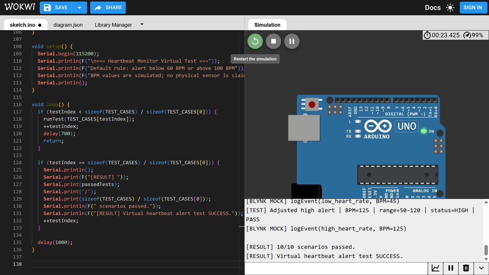
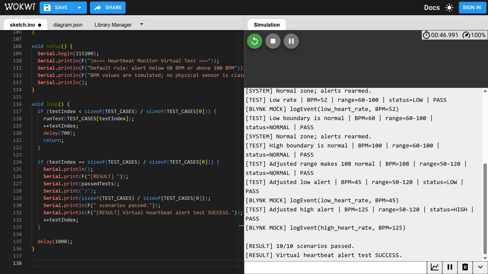

# AI-Enabled Heartbeat Monitor with Blynk

This ESP32 project reads BPM from a PulseSensor, shows the reading and status in
Blynk, and requests a mobile push notification when the heart rate is **below
60 BPM** or **above 100 BPM**. The alert is transition-based: a continuing
abnormal reading does not flood the phone, and a normal reading rearms alerts.

## Project contents

- `HeartbeatMonitor.ino`: production PulseSensor, ESP32, and Blynk sketch
- `HeartbeatConfig.h`: default BPM limits and sensor threshold
- `HeartbeatSecrets.example.h`: safe template for the ignored credentials file
- `libraries.txt`: libraries used by the production sketch
- `../HeartbeatMonitorVirtualTest/HeartbeatMonitorVirtualTest.ino`: Wokwi-safe
  deterministic Arduino test without hardware or secrets
- `../tools/heartbeat_demo.py`: matching PC test harness
- `../docs/BLYNK_SETUP.md`: datastream, event, and dashboard setup
- `../docs/HEARTBEAT_WIRING.md`: sensor wiring and safety note

## Threshold behavior

| Reading | Default status | Action |
|---|---|---|
| BPM < 60 | LOW | `Blynk.logEvent("low_heart_rate", ...)` |
| 60 <= BPM <= 100 | NORMAL | No alert; rearm notifications |
| BPM > 100 | HIGH | `Blynk.logEvent("high_heart_rate", ...)` |

Change the compile-time defaults in `HeartbeatConfig.h`, or change V2/V3 from
the Blynk app while the device is online. For example, 50-120 BPM makes 108 BPM
normal but still alerts at 45 and 125 BPM.

## Run the hardware-free test

```powershell
python tools/heartbeat_demo.py
```

For an Arduino virtual run, open the Wokwi Arduino UNO template, replace its
sketch with `HeartbeatMonitorVirtualTest.ino`, start the simulation, and inspect
the Serial Monitor. This demonstrates the alert decisions and mock Blynk calls;
real phone notifications require configured Blynk credentials and an ESP32.

## Verified output

The production ESP32 sketch and virtual UNO sketch compile successfully, and
both the Python virtual environment and Wokwi execution passed all 10 test
scenarios. See `../docs/HEARTBEAT_EXECUTION_REPORT.txt` for exact memory usage.





> Educational prototype only. It is not a medical device and must not be used
> for diagnosis or emergency decisions.
